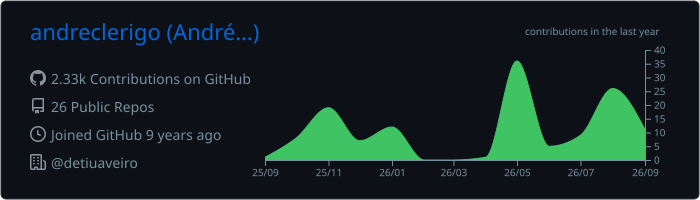
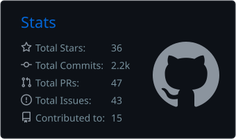
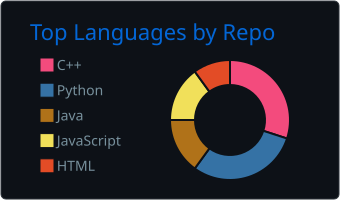
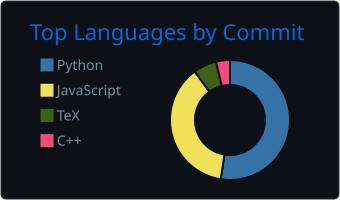
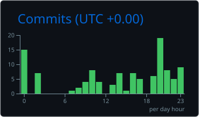

# Hi there! 👋

### Follow me on this journey of wanting to learn everything but not having time for anything

 

## GitHub Overview

  
  

  
  

 

## Selected Projects

- [pico-projects](https://github.com/andreclerigo/pico-projects) — Raspberry Pi Pico and embedded systems projects.
- [learning-electronics](https://github.com/learning-electronics/learning-electronics) — Electronics learning material and examples.
- [leci_2ano](https://github.com/andreclerigo/leci_2ano) — Second-year LECI coursework and projects.
- [leci_3ano](https://github.com/andreclerigo/leci_3ano) — Third-year LECI coursework and projects.
- [weather_twitterbot](https://github.com/andreclerigo/weather_twitterbot) — Weather bot project.
- [cryptochecker](https://github.com/andreclerigo/cryptochecker) — Cryptocurrency checking tool.

 

## Support

Liked some of my work? Support me or buy me a coffee!

